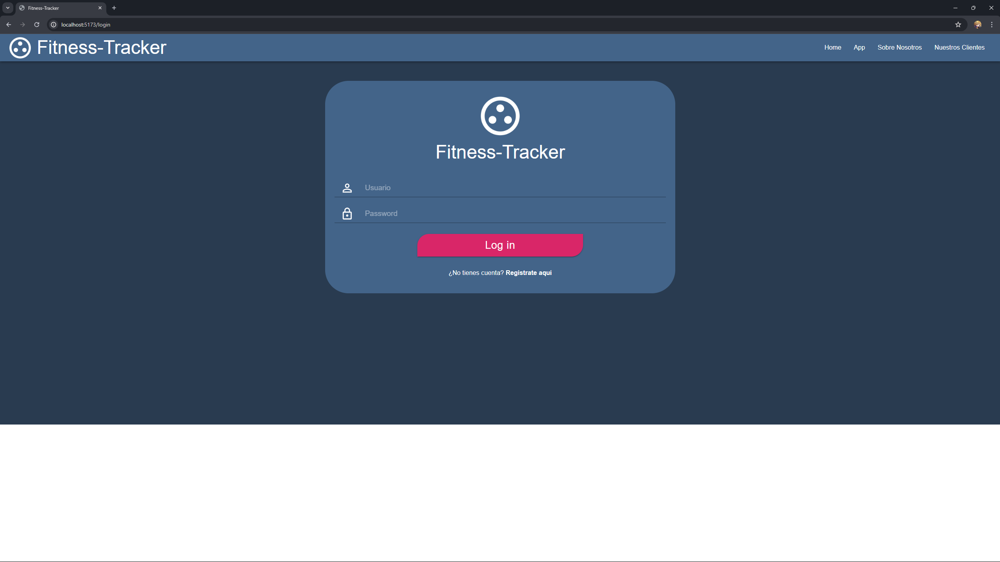

# Fitness Tracker

Trabajo de fin de grado de aplicación para gestionar el entrenamiento físico.

## Cliente web



## Cliente Android

<p>
    
    
</p>

## Breve introducción

La gente hoy en día está muy interesada en mantener un estado de salud bueno, realizando ejercicios físicos ya sea en el gimnasio o en casa. Creemos que construir herramientas que permitan a un usuario cualquiera tener constancia de su estado físico es algo esencial, aún más si esta herramienta es de fácil acceso con un uso intuitivo.

Este proyecto es también una forma de ampliar nuestros conocimientos en librerías que no hemos explorado lo suficientemente a fondo durante el curso académico y creemos que por nuestra cuenta podríamos avanzar bastante más.

## Estructura

El proyecto consta de varias aplicaciones. Una aplicación cliente Android, una aplicación cliente Web y dos servicios que componen el conjunto backend.

## Cliente Android

- Funcionalidades Principales:

1.

- Ejecución:

1. Seleccionamos y abrimos la carpeta de android-client medienta el editor Android Studio.
2. El editor debería ser capaza de actualizar los paquetes de Gradle si es necesario, si no probar con el proyecto en la rama master.
3. Hacer clic sobre Debug para ejecutar la aplicación.

- Detalles editor Android Studio usado:

Android Studio Hedgehog | 2023.1.1
Build #AI-231.9392.1.2311.11076708, built on November 9, 2023

Runtime version: 17.0.7+0-b2043.56-10550314 amd6
VM: OpenJDK 64-Bit Server VM by JetBrains s.r.o.

## Cliente Web

- Funcionalidades Principales:

1. Iniciar sesión.
2. Consultar dietas e información nutricional.
3. Acceso a asitenta por inteligencia artificial.
4. Generación de dietas a medida.

- Ejecución:

1. Acceder a la carpeta web-client y ejecutamos los comandos:

```shell
npm i
npm install react-bootstrap bootstrap
npm install @mui/material @emotion/react @emotion/styled
npm install @mui/icons-material @mui/material @emotion/styled @emotion/react

npm run dev
```

Para acceder a las rutas vamos contra ``localhost:5173/`` que es donde está ejecuntándose la aplicación.

## REST Base

- Funcionalidades Principales:

1. Iniciar sesión.
2. Consultar dietas e información nutricional.

- Ejecución:

1. Paso1
2. Paso2, etc...

## REST AI

Esta API REST proporciona una interfaz para integrar la funcionalidad de generación de texto de ChatGPT en aplicaciones externas. Utiliza endpoints específicos para enviar solicitudes a ChatGPT y recibir respuestas generadas por el modelo de lenguaje. La integración de esta API permite a los aprovechar el potencial de ChatGPT para integrar el asistente virtual que ofrece nuestro sistema.

- Funcionalidades Principales:

1. Lanzamiento de Prompts: Permite enviar prompts o estímulos de entrada a ChatGPT para generar respuestas de texto coherentes y contextualmente relevantes.
2. Control de Parámetros: Proporciona opciones para ajustar parámetros como la longitud máxima de la respuesta.
3. Integración Sencilla: Ofrece una interfaz intuitiva y documentada para facilitar la integración con sistemas externos, incluyendo ejemplos de solicitud y respuesta.

- Documentación y Ejemplos:

Para obtener más información sobre cómo utilizar esta API y acceder a ejemplos de código, consulta la documentación detallada disponible [aquí](/info/docs/Documentación%20API%20IA.pdf).

- Ejecución:

1. Abrir el proyecto con Visual Studio (Para el desarollo se utilizó VS 2022 en su versión 17.9.5).
2. Vamos a Debug, y Start Debugging.
